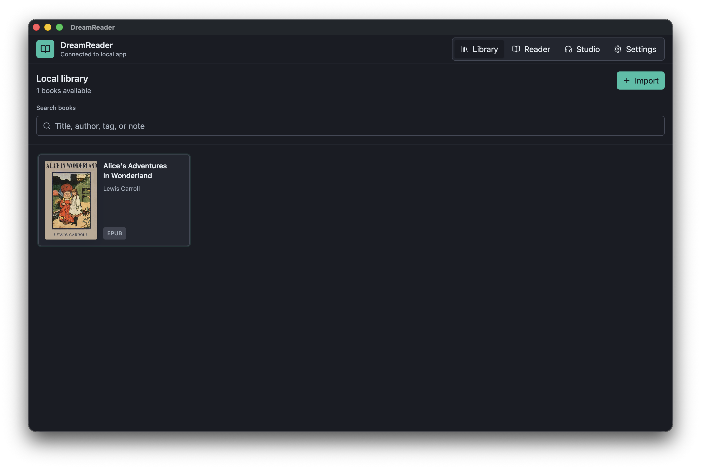
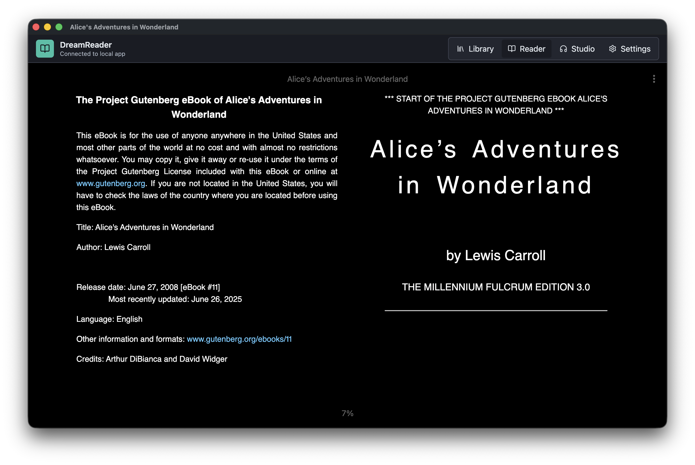
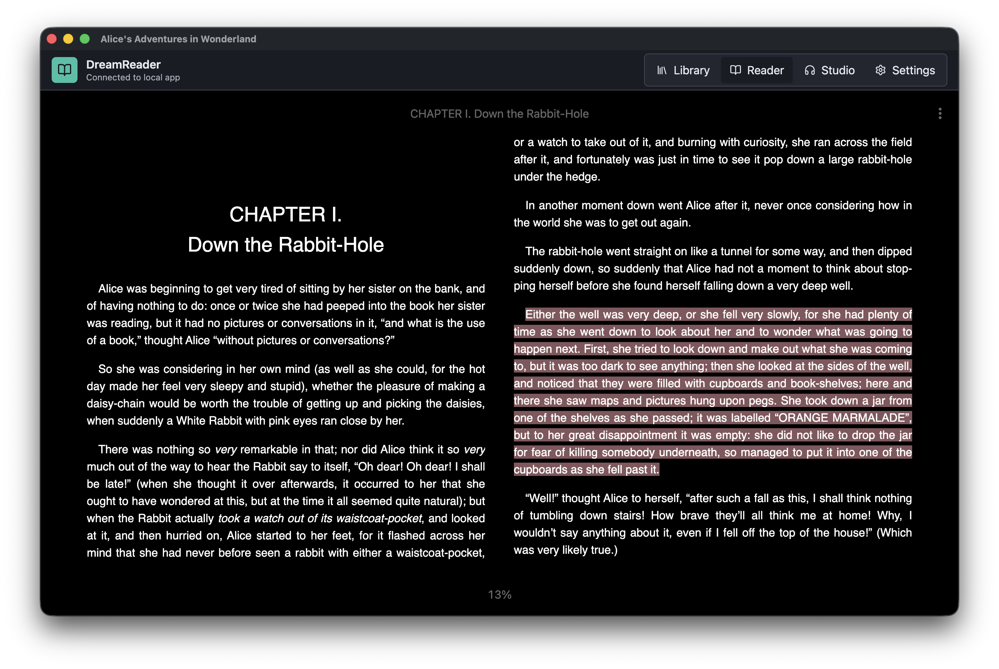
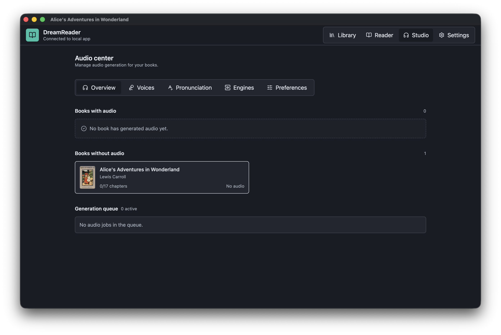
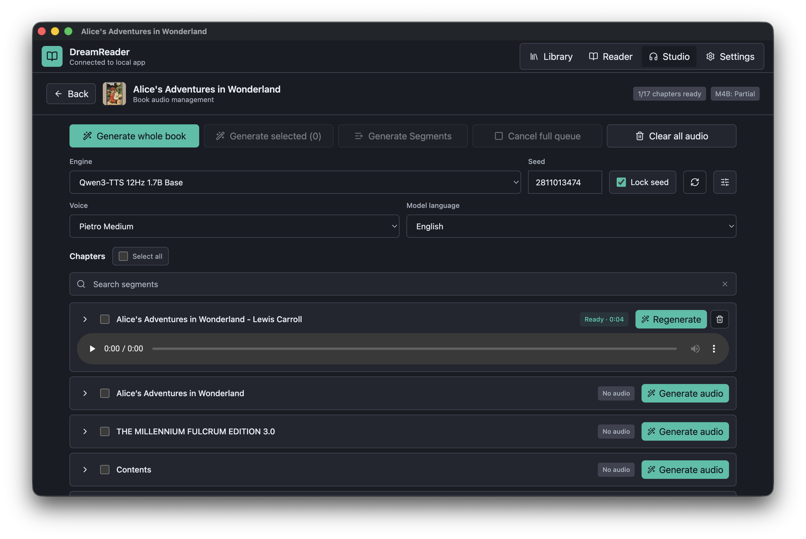
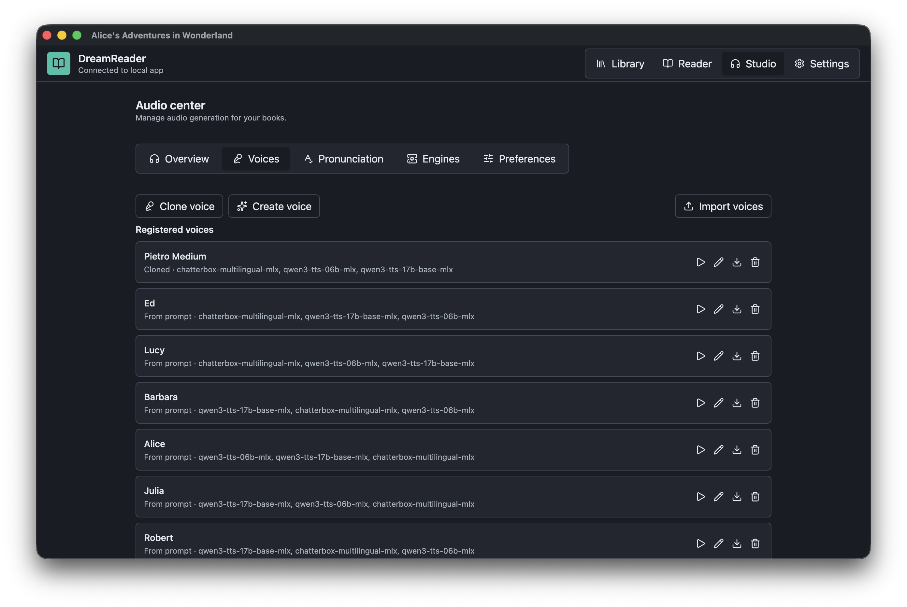
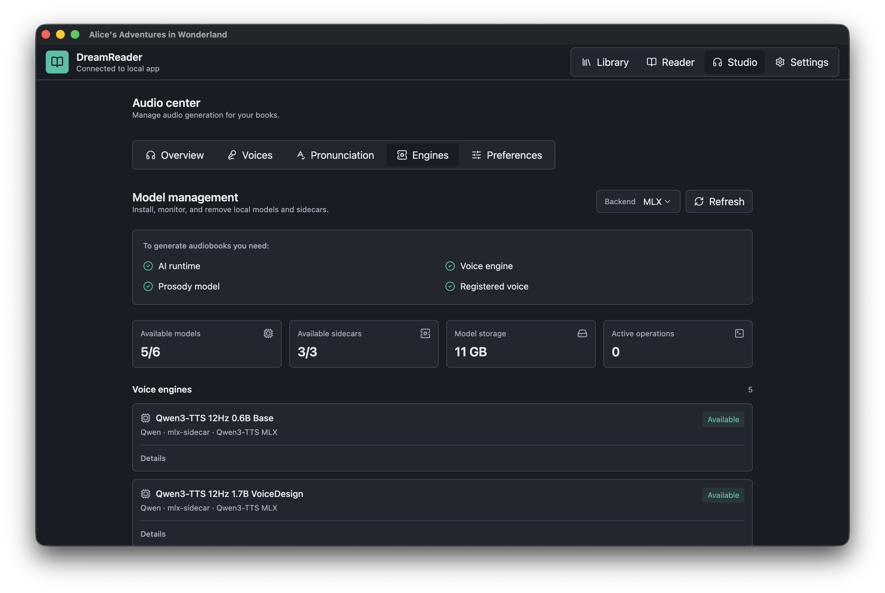
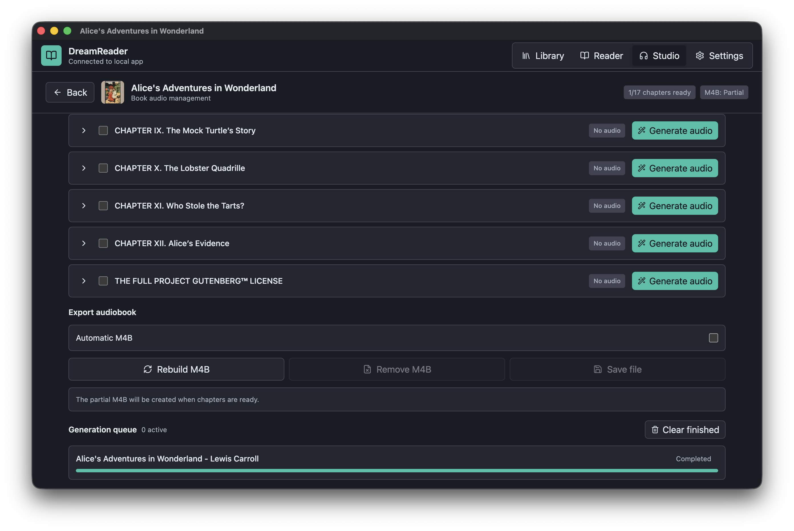

# DreamReader

DreamReader is a local-first desktop ebook reader for macOS, Linux, and Windows. It combines a full reading experience with offline text-to-speech, expressive narration, local voice management, and incremental M4B audiobook creation.

Books, annotations, generated audio, voices, and model settings stay on the user's computer by default.



## Features

### Local library and imports

- Imports EPUB, PDF, TXT, Markdown, and HTML files through the native file picker.
- Stores imported books in an internal local library and detects duplicates by content hash.
- Extracts EPUB metadata, authors, language, table of contents, reading order, and cover artwork.
- Supports EPUB navigation based on NCX, anchors, nested navigation, and multiple chapters stored in one HTML resource.
- Uses Readium CLI metadata when available and falls back to the built-in importer.
- Extracts readable PDF text with PDF.js and detects chapter boundaries with heuristics or the optional local Qwen prosody model.
- Provides grid and list library views, metadata search, reading status, progress indicators, and book removal.
- Removes associated annotations, generated audio, and audiobook data when a book is deleted.

### Reading experience

- Integrated Thorium/Readium publication reader for EPUB content.
- Continuous and paginated reading, including one- or two-column layouts.
- Persistent Readium locators and automatic resume from the last saved position.
- Table-of-contents navigation, previous/next chapter controls, page navigation, overall progress, and chapter progress.
- Reader themes, font family and size, column width, line height, paragraph spacing, margins, alignment, and hyphenation controls.
- Clean reading mode, collapsible/resizable inspector, and return-to-previous-position navigation.
- Inline footnote popups and support for publication images and rich EPUB resources.
- Colored highlights, notes, and favorite passages anchored by paragraph and character offset.
- Annotation filtering, editing, deletion, direct navigation, and Markdown/JSON export.
- English and Brazilian Portuguese interface localization.

### Offline audio and TTS Studio

- Dedicated Audio Center with per-book audio status and a persistent generation queue.
- Generates audio for an entire book, selected chapters, one chapter, or individual text segments.
- Chapter and segment search, selection, regeneration, deletion, retry, pause, resume, and cancellation controls.
- Persistent TTS jobs and segments that recover after the application restarts.
- Local audio cache with reuse when the same chapter and settings are requested again.
- Built-in chapter playback and generation progress at book, chapter, job, and segment levels.
- Engine, voice, model language, quality, seed, and expressive-narration settings.
- Locked or randomized seeds for reproducible voice generation.
- Automatic cache and M4B invalidation when the engine, voice, prosody, pronunciation dictionary, or generated chapter changes.

### Local engines and model management

- Qwen3-TTS 0.6B, Qwen3-TTS 1.7B Base, Qwen3-TTS 1.7B VoiceDesign, Chatterbox Multilingual, and F5-TTS PT-BR engine definitions.
- Supervised local sidecars for Qwen3-TTS MLX, Chatterbox MLX, and F5-TTS PT-BR.
- Standalone local Python runtime setup for sidecars without modifying the system Python installation.
- MLX/MPS support on Apple Silicon and CUDA or Vulkan setup paths on Windows and Linux.
- Local model catalog, readiness diagnostics, storage usage, download/install progress, retries, folder-based installation, and removal.
- Optional Qwen3 4B GGUF prosody model through `node-llama-cpp`, with a deterministic local fallback.
- Sidecar output validation and Electron main-process supervision.

### Expressive narration

- Canonical `NarrationPlan` pipeline shared by every TTS adapter.
- Brazilian Portuguese normalization for abbreviations, dates, times, currency, percentages, and sentence segmentation.
- Structured prosody instructions for emotion, pace, pitch, intensity, pauses, and voice role.
- Persistent segment-level prosody cache.
- Neutral fallback for missing, invalid, or incomplete model output.
- Neutral-versus-expressive audio comparison when both versions are available.
- Per-job metadata for prosody mode, cache hits, generated analyses, and fallbacks.

### Voices and pronunciation

- Local voice profiles with engine-specific compatibility bindings.
- Voice cloning from authorized reference audio and transcript, with explicit consent required.
- Qwen VoiceDesign prompt-based voice creation with preview before saving.
- Voice preview, rename, export, import, and deletion.
- Imports one or more `DreamReader Voice` ZIP packages.
- Bundled voice packages are imported automatically on first launch and reconciled when compatible engines are installed.
- Global and per-book pronunciation dictionaries included in the TTS cache key.
- Chatterbox multilingual language selection and optional reference-voice cloning.

### Audiobooks

- Real AAC/M4B generation through the bundled `ffmpeg-static` binary.
- Incremental partial M4B output as chapters become available.
- Automatic or manual M4B rebuild.
- Save/export and removal controls for generated audiobook files.
- Persistent audiobook manifest and chapter metadata.
- A failed M4B rebuild never invalidates already generated chapter audio.

### Local-first architecture and safety

- Electron sandbox, context isolation, disabled renderer Node integration, and a narrow preload bridge.
- Shared Zod contracts validate IPC requests across renderer/main boundaries.
- PGlite and Drizzle provide the persistent local database.
- Registered assets are exposed through controlled `dreamreader://` protocols instead of unrestricted `file://` URLs.
- Models, Python runtimes, generated audio, cloned voices, and books remain local unless the user explicitly exports a file.
- No cloud synchronization, online bookstore, social layer, or DRM removal.

## Screenshots

<table>
  <tr>
    <td width="50%" align="center">
      
      <br /><strong>Extracted EPUB cover</strong>
    </td>
    <td width="50%" align="center">
      
      <br /><strong>Paginated EPUB reader</strong>
    </td>
  </tr>
  <tr>
    <td width="50%" align="center">
      
      <br /><strong>Two-column reading and highlights</strong>
    </td>
    <td width="50%" align="center">
      
      <br /><strong>Audio Center overview</strong>
    </td>
  </tr>
  <tr>
    <td width="50%" align="center">
      
      <br /><strong>Chapter audio generation</strong>
    </td>
    <td width="50%" align="center">
      
      <br /><strong>Voice manager</strong>
    </td>
  </tr>
  <tr>
    <td width="50%" align="center">
      
      <br /><strong>Engine and model management</strong>
    </td>
    <td width="50%" align="center">
      
      <br /><strong>M4B export and generation queue</strong>
    </td>
  </tr>
</table>

## Download

Version `0.1.0` bundles are stored in this repository with Git LFS:

| Platform | Architecture | Download |
| --- | --- | --- |
| macOS | Apple Silicon (`arm64`) | [DreamReader-0.1.0-mac-arm64.dmg](https://github.com/mbellezi/dreamreader/raw/main/bundles/DreamReader-0.1.0-mac-arm64.dmg) |
| Linux | Intel/AMD (`x86_64`) | [DreamReader-0.1.0-linux-x86_64.AppImage](https://github.com/mbellezi/dreamreader/raw/main/bundles/DreamReader-0.1.0-linux-x86_64.AppImage) |
| Windows | Intel/AMD (`x64`) | [DreamReader-0.1.0-win-x64.exe](https://github.com/mbellezi/dreamreader/raw/main/bundles/DreamReader-0.1.0-win-x64.exe) |

Integrity hashes are available in [`bundles/SHA256SUMS`](bundles/SHA256SUMS).

The repository is currently private, so GitHub authentication and repository access are required to download these files. These local builds are not code-signed or notarized; macOS Gatekeeper and Windows SmartScreen may display a warning on first launch.

### Install

- **macOS:** Open the DMG and drag DreamReader into **Applications**. This build requires Apple Silicon. If Gatekeeper blocks the first launch, right-click the app and choose **Open**, or authorize it under **System Settings > Privacy & Security**.
- **Linux:** Run `chmod +x DreamReader-0.1.0-linux-x86_64.AppImage`, then launch the AppImage.
- **Windows:** Run `DreamReader-0.1.0-win-x64.exe` and follow the NSIS installer.

Every bundle includes the ZIP packages at the root of `voices/`.

## Development

### Requirements

- Git
- A recent Node.js LTS release and npm
- Python 3 for the bundle orchestrator
- Git LFS if you want the prebuilt bundles
- Additional disk space for optional local TTS runtimes and models

### Full local setup

```bash
git clone https://github.com/mbellezi/dreamreader.git
cd dreamreader
npm run setup:dev
npm run dev
```

`npm run setup:dev` installs Node dependencies, downloads the Readium CLI for the current platform, prepares the standalone Python runtime and TTS sidecars, and downloads/configures the supported local TTS models.

Preview the setup steps without installing or downloading anything:

```bash
npm run setup:dev -- --dry-run
```

### Minimal reader-only setup

```bash
npm ci
npm run download:readium-cli
npm run dev
```

`npm run dev` starts Electron with automatic recompilation. The minimal setup is enough for the library and reader; local neural TTS requires the full setup or manual engine installation.

The default clone also downloads approximately 2.1 GB of Git LFS bundles. To clone only the source:

```bash
GIT_LFS_SKIP_SMUDGE=1 git clone https://github.com/mbellezi/dreamreader.git
cd dreamreader
```

In PowerShell, set `$env:GIT_LFS_SKIP_SMUDGE = "1"` before cloning. Run `git lfs pull` later to download the bundles.

### TTS backend setup

Apple Silicon uses MLX/MPS by default. On Windows and Linux, select CUDA or Vulkan:

```bash
npm run setup:python-tts -- --backend=cuda --install-sidecars
npm run setup:python-tts -- --backend=vulkan --install-sidecars
npm run download:tts-models -- --backend=cuda
```

### Validate a development build

```bash
npm run lint
npm test
npm run build
```

## Build desktop bundles

Cross-platform packaging is orchestrated by `scripts/build-bundle.py`. It checks host dependencies, downloads all Readium CLI targets, installs target-specific optional dependencies, rebuilds `ffmpeg-static`, runs `electron-builder`, and reports the artifact path and SHA-256 hash.

```bash
python3 scripts/build-bundle.py --target linux-appimage
python3 scripts/build-bundle.py --target windows-msi
python3 scripts/build-bundle.py --target mac-dmg
python3 scripts/build-bundle.py --target all
```

Host requirements:

- Linux AppImage builds natively on Linux; macOS and Windows require Docker or WSL2.
- Windows installer builds natively on Windows; Linux and macOS require Wine.
- macOS DMG builds require macOS.
- `--target all` builds Linux and Windows targets and also includes macOS when running on a Mac.

Useful examples:

```bash
python3 scripts/build-bundle.py --target linux-appimage --arch x64 --linux-runner docker
python3 scripts/build-bundle.py --target linux-appimage --arch arm64 --linux-runner docker
python3 scripts/build-bundle.py --target windows-msi --check-only
python3 scripts/build-bundle.py --target windows-msi --keep-intermediate
python3 scripts/build-bundle.py --target mac-dmg --arch arm64
python3 scripts/build-bundle.py --target mac-dmg --signed-mac
```

Cross-builds can leave `node_modules/` prepared for the target platform. Run `npm ci` afterward to restore dependencies for the current host. See [`docs/11-build-bundles.md`](docs/11-build-bundles.md) for Wine, Docker, WSL2, and Wrapped MSI details.

## Voice packages

DreamReader imports ZIP archives that follow the `DreamReader Voice` package format:

1. Start the app and open **Studio > Voices**.
2. Choose **Import voices**.
3. Select one or more compatible ZIP packages.
4. Install a compatible engine under **Studio > Engines** to enable preview and generation.

Packages with reference audio create bindings for installed voice-cloning engines. Prompt-based packages become available to Qwen VoiceDesign when that engine is installed.

## Main commands

```bash
npm install
npm run setup:dev
npm run dev
npm test
npm run test:tts-models
npm run lint
npm run build
npm run download:readium-cli
npm run setup:python-tts
npm run download:tts-models
npm run db:generate
npm run db:migrate
```

Use `--install-sidecars` to install Python sidecar dependencies. The CUDA backend uses the official PyTorch CUDA wheel index by default; override it with `DREAMREADER_TORCH_CUDA_INDEX_URL`.

## Documentation

- [Product specification](docs/00-product-spec.md)
- [Architecture](docs/01-architecture.md)
- [AI and TTS pipeline](docs/02-ai-tts-pipeline.md)
- [Data model](docs/03-data-model.md)
- [Roadmap](docs/04-roadmap.md)
- [Research notes](docs/05-research-notes.md)
- [Apple Silicon performance](docs/06-apple-silicon-performance.md)
- [TTS and prosody abstractions](docs/07-tts-prosody-abstractions.md)
- [M4B audiobook pipeline](docs/08-audiobook-m4b.md)
- [Readium proof of concept](docs/09-readium-poc.md)
- [Thorium/Readium troubleshooting](docs/10-thorium-reader-troubleshooting.md)
- [Cross-platform bundle builds](docs/11-build-bundles.md)
